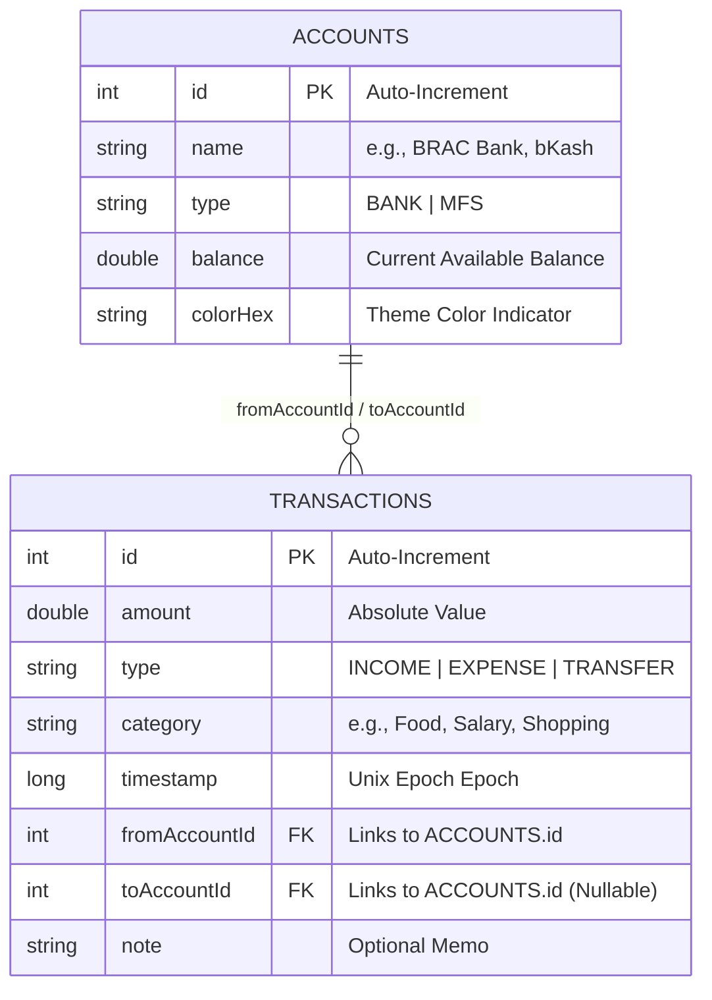

# FinanceBuddy

FinanceBuddy is a modern, minimal, and offline-first personal finance manager designed specifically for Bangladeshi users. Built with modern Android development patterns, the application allows users to seamlessly track incomes, daily expenses, and inter-account transfers across local banks and mobile financial services (MFS) with absolute privacy.

---

## Technical Architecture

FinanceBuddy is engineered using clean architecture principles, leveraging declarative UI patterns and a highly reactive unidirectional data flow.

### Architecture Pillars

*   **Offline-First & Local-Only Data Policy**: All financial records, accounts, and configuration states are persisted locally on the device (no cloud synchronization or external APIs) to guarantee user privacy and data security.
*   **Single-Activity Scaffolding**: Utilizes Compose Navigation (`NavHost`) to manage state transitions across screen destinations.
*   **Reactive Data Flow**: Features Room Database queries that expose asynchronous stream values (`Flow`), which are collected as state within UI composables to instantly reflect updates throughout the app.
*   **Custom Graphics rendering**: Utilizes lower-level `Canvas` APIs for custom rendering of data charts to optimize draw call performance and achieve bespoke dark-theme visuals.

---

## Core Technologies

*   **UI Framework**: Jetpack Compose (Declarative UI) with Material 3 design tokens.
*   **Local Persistence Layer**: 
    *   **Room Database**: Standard relational SQLite engine wrapper for structured financial transactional data.
    *   **Preferences DataStore**: Proto-alternative key-value store for lightweight configuration states (onboarding completion).
*   **Asynchronous Concurrency**: Kotlin Coroutines & Reactive Flow for non-blocking I/O.
*   **Code Generation**: Kotlin Symbol Processing (KSP) for compile-time database mapping and query validation.
*   **Typography Assets**: Bundled custom Outfit Sans typeface weights.

---

## Database Architecture

The local SQLite schema operates with relational constraints to guarantee transaction and balance consistency.



### Self-Synchronizing Balances
The database design delegates transaction-balance math to database-level transactions using Room's `@Transaction` model:
- **Income Insertion**: Increases target account balance.
- **Expense Insertion**: Decreases target account balance.
- **Transfer Insertion**: Atomically transfers value between source and destination accounts.
- **Deletion Reversal**: Automatically restores previous balances on transaction removal.

---

## Project Structure

```
app/src/main/java/com/shejan/financebuddy/
├── data/
│   ├── db/
│   │   ├── AccountEntity.kt      # Account database model
│   │   ├── TransactionEntity.kt  # Transaction database model
│   │   ├── AccountDao.kt         # Queries for wallets/institutions
│   │   ├── TransactionDao.kt     # Atomic balance-adjusting transaction queries
│   │   └── FinanceDatabase.kt    # Room database setup & seeding logic
│   └── PreferencesManager.kt     # DataStore preferences configuration
├── ui/
│   ├── home/
│   │   ├── components/
│   │   │   └── Charts.kt         # Custom Canvas-drawn Bar & Line charts
│   │   ├── HomeScreen.kt         # Dashboard UI implementation
│   │   └── AddTransactionSheet.kt# Sliding modal transaction form sheet
│   ├── onboarding/
│   │   ├── OnboardingPage.kt     # Pager metadata model
│   │   └── OnboardingScreen.kt   # Interactive slider & Canvas visuals
│   └── theme/
│       ├── Color.kt              # Dark fintech color palettes
│       ├── Type.kt               # Custom Outfit font definitions
│       └── Theme.kt              # Edge-to-edge system window theme hooks
└── MainActivity.kt               # Root Navigation host and database controller
```

---

## Features

### 1. Seeding of Bangladeshi Institutions
Upon initialization, the database seeds default institutions:
- **Banks**: BRAC Bank PLC, Dutch-Bangla Bank (DBBL)
- **MFS**: bKash, Nagad, Rocket

### 2. High-Performance Canvas-Drawn Charts
To ensure smooth frame transitions without importing heavy third-party chart libraries:
- **Weekly Expenses Bar Chart**: Automatically sums and visualizes daily expense totals for the last 7 calendar days.
- **Balance Trend Bezier Chart**: Computes running balances dynamically by subtracting daily net-change from the total balance going backward. Plots a smooth curved line.

### 3. Dynamic Transaction Drawer
An intuitive input modal allowing users to quickly record incomes, expenses, or transfers. Form inputs dynamically adapt options (such as hiding destination selectors for non-transfers) and perform field validation.

### 4. Edge-to-Edge Visual Styling
Configures translucent and transparent status bar properties so content is rendered fullscreen behind system indicators. Includes safe padding to prevent overlays with time and network hardware cutouts.

---

## Build and Setup

### Prerequisites
- JDK 17+
- Android SDK 35+ (API 37 Target)
- Android Studio Ladybug (or later)

### Compilation Steps

1. Clone the repository to your local path.
2. Initialize build via Gradle wrapper:
   ```bash
   ./gradlew assembleDebug
   ```
3. Run unit compilation:
   ```bash
   ./gradlew compileDebugKotlin
   ```
