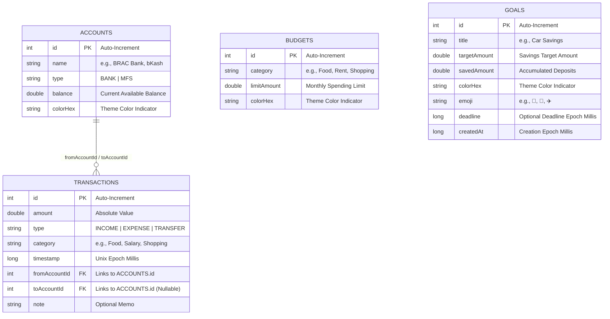

# FinanceBuddy

FinanceBuddy is a modern, premium, and offline-first personal finance manager designed specifically for Bangladeshi users. Built with modern Android development patterns, the application allows users to track incomes, daily expenses, inter-account transfers, category budgets, and savings goals across local banks and mobile financial services (MFS) with complete security, hardware-backed encryption, and total offline privacy.

---

## Technical Architecture

FinanceBuddy is engineered using Clean Architecture principles, leveraging declarative UI patterns and a highly reactive unidirectional data flow.

### Architecture Pillars

*   **Zero-Cloud Offline Privacy**: All transaction records, budget configurations, and savings targets are persisted locally on the device with no external server sync, ensuring complete financial privacy.
*   **Hardware-Backed Security**: The local SQLite database is fully encrypted at rest. Passphrases are generated cryptographically and secured inside the device's hardware Keystore.
*   **Persistent Schema Migrations**: Avoids destructive database drops by utilizing version-controlled migration scripts for schema updates.
*   **Single-Activity Scaffolding**: Uses Jetpack Compose Navigation (`NavHost`) to manage state transitions across screens (Home, Budget, Goals).
*   **Reactive Flow Channels**: Employs Room Database queries that expose asynchronous stream values (`Flow`), which are collected as state within UI composables to instantly reflect changes.
*   **Custom Graphics Rendering**: Utilizes lower-level `Canvas` APIs for custom rendering of data charts, arc overviews, and progress rings to maximize drawing performance.

---

## Core Security & Encryption

To protect sensitive financial information, FinanceBuddy implements a multi-layered local security model:

```
                  ┌──────────────────────────────────────────┐
                  │          Jetpack Room Database           │
                  └────────────────────┬─────────────────────┘
                                       │ SQLCipher SupportFactory
                  ┌────────────────────▼─────────────────────┐
                  │         SQLCipher Engine (AES-256)       │
                  │     (Encrypts database file at rest)     │
                  └────────────────────┬─────────────────────┘
                                       │ 256-bit passphrase
                  ┌────────────────────▼─────────────────────┐
                  │        EncryptedSharedPreferences        │
                  │   (Stores passphrase encrypted with AES)  │
                  └────────────────────┬─────────────────────┘
                                       │ Hardware Master Key
                  ┌────────────────────▼─────────────────────┐
                  │         Android Keystore System          │
                  │    (Key isolated inside hardware TEE)    │
                  └──────────────────────────────────────────┘
```

1.  **Database-Level Encryption**: The entire database is encrypted using **SQLCipher** (AES-256-CBC). Unencrypted database files cannot be read even on rooted devices.
2.  **Key Management**: A cryptographically secure 256-bit random passphrase is generated on the first run using `SecureRandom`.
3.  **Hardware Storage**: The passphrase is stored in `EncryptedSharedPreferences`, encrypted with a Master Key generated inside the **Android Keystore** (utilizing a hardware-backed Trusted Execution Environment / TEE if available on the device).

---

## Core Technologies

*   **UI Framework**: Jetpack Compose (Declarative UI) with custom Material 3 design tokens.
*   **Security & Crypto**: SQLCipher for Android (`android-database-sqlcipher`), Android Jetpack Security (`security-crypto`).
*   **Local Persistence Layer**: 
    *   **Room Database**: Relational SQLite engine wrapper for financial transactions, accounts, budgets, and savings goals.
    *   **Preferences DataStore**: Jetpack DataStore key-value store for lightweight configuration states (onboarding completion).
*   **Asynchronous Concurrency**: Kotlin Coroutines & Reactive Flow for non-blocking I/O.
*   **Code Generation**: Kotlin Symbol Processing (KSP) for compile-time database mapping and query validation.
*   **Typography Assets**: Bundled custom Outfit Sans typeface weights.

---

## Database Architecture

The local SQLite schema operates with relational constraints to guarantee transaction and balance consistency.



### Self-Synchronizing Balances
The database design delegates transaction-balance math to database-level transactions using Room's `@Transaction` model:
- **Income Insertion**: Increases target account balance.
- **Expense Insertion**: Decreases target account balance.
- **Transfer Insertion**: Atomically transfers value between source and destination accounts.
- **Deletion Reversal**: Automatically restores previous balances on transaction removal.

---

## Project Structure

```
app/src/main/java/com/shejan/financebuddy/
├── data/
│   ├── db/
│   │   ├── AccountEntity.kt      # Account database model
│   │   ├── TransactionEntity.kt  # Transaction database model
│   │   ├── BudgetEntity.kt       # Budget limit database model
│   │   ├── GoalEntity.kt         # Savings Goal database model
│   │   ├── AccountDao.kt         # Queries for wallets/institutions
│   │   ├── TransactionDao.kt     # Atomic balance-adjusting transaction queries
│   │   ├── BudgetDao.kt          # Category-based budget constraint queries
│   │   ├── GoalDao.kt            # Savings goal deposit and CRUD queries
│   │   ├── DatabaseMigrations.kt # Version-controlled schema migration scripts (1→2, 2→3, 3→4)
│   │   ├── DatabaseKeyManager.kt # Android Keystore-backed database encryption keys
│   │   └── FinanceDatabase.kt    # Encrypted Room database configuration & seeding logic
│   └── PreferencesManager.kt     # DataStore preferences configuration (Onboarding state)
├── ui/
│   ├── home/
│   │   ├── components/
│   │   │   └── Charts.kt         # Custom Canvas-drawn Bar & Line charts
│   │   ├── HomeScreen.kt         # Dashboard UI implementation
│   │   └── AddTransactionSheet.kt# Sliding modal transaction form sheet
│   ├── budget/
│   │   └── BudgetScreen.kt       # Budgeting interface, Canvas overview arc, and CRUD sheets
│   ├── goals/
│   │   └── GoalsScreen.kt        # Savings goal progress rings, deposit forms, and emoji selectors
│   ├── onboarding/
│   │   ├── OnboardingPage.kt     # Pager metadata model
│   │   └── OnboardingScreen.kt   # Interactive slider & Canvas visuals
│   └── theme/
│       ├── Color.kt              # Dark fintech color palettes
│       ├── Type.kt               # Custom Outfit font definitions
│       └── Theme.kt              # Edge-to-edge system window theme hooks
└── MainActivity.kt               # Root Navigation host, Drawer layout, and database lifecycle
```

---

## Features

### 1. Seeding of Bangladeshi Institutions
Upon initialization, the database seeds default local financial institutions:
- **Banks**: BRAC Bank PLC, The City Bank PLC, Eastern Bank PLC (EBL), Dutch-Bangla Bank PLC (DBBL), Prime Bank PLC, Mutual Trust Bank PLC, Islami Bank Bangladesh PLC (IBBL), Al-Arafah Islami Bank PLC, Shahjalal Islami Bank PLC.
- **MFS**: bKash, Nagad, Rocket, Upay, CellFin (IBBL), Ok Wallet, MyCash.

### 2. High-Performance Custom Charts
Bespoke charts designed with native Compose Canvas drawing APIs:
- **Weekly Expenses Bar Chart**: Automatically sums and visualizes daily expense totals for the last 7 calendar days.
- **Balance Trend Bezier Chart**: Computes running balances dynamically by subtracting daily net-change from the total balance going backward. Plots a smooth curved line.

### 3. Dynamic Budgeting Dashboard
- **Monthly Limit Constraints**: Set monthly spending limits per category.
- **Visual Warning Metrics**: Visualizes total budget usage with a custom Canvas arc meter that dynamically updates color states as categories approach thresholds.
- **Spent-vs-Limit Trackers**: Highlights remaining balance versus spent totals per category.

### 4. Interactive Savings Goals
- **Animated Circular Progress**: Renders a custom 360-degree Canvas progress ring around goal indicators.
- **Secure Deposits**: Add manual savings increments directly to goals (contributions are tracked in-app).
- **Goal Personalization**: Complete custom emoji grid picker and dynamic color-coding.
- **Deadline Metrics**: Automatically computes and highlights remaining days/months before targets.

---

## Build and Setup

### Prerequisites
- JDK 17+
- Android SDK 35+ (API 37 Target)
- Android Studio Ladybug (or later)

### Compilation Steps

1. Clone the repository to your local path.
2. Initialize build via Gradle wrapper:
   ```bash
   ./gradlew assembleDebug
   ```
3. Run unit compilation:
   ```bash
   ./gradlew compileDebugKotlin
   ```
