<p align="center">
  
</p>

<h1 align="center">FinanceBuddy</h1>

<p align="center">
  <strong>A premium, offline-first personal finance manager tailored for Bangladesh.</strong>
</p>

---

**FinanceBuddy** is a modern, premium, and offline-first personal finance manager designed specifically for Bangladeshi users. Built with modern Android development patterns, the application allows users to track incomes, daily expenses, inter-account transfers, category budgets, and savings goals across local banks and mobile financial services (MFS) with complete security, hardware-backed encryption, and total offline privacy.

---

## Technical Architecture

FinanceBuddy is engineered using Clean Architecture principles, leveraging declarative UI patterns and a highly reactive unidirectional data flow.

### Architecture Pillars

*   **Zero-Cloud Offline Privacy**: All transaction records, budget configurations, and savings targets are persisted locally on the device with no external server sync, ensuring complete financial privacy.
*   **Hardware-Backed Security**: The local SQLite database is fully encrypted at rest. Passphrases are generated cryptographically and secured inside the device's hardware Keystore.
*   **Automated SMS Parsing**: Fully on-device parsing of transaction SMS notifications from Bangladeshi banks and MFS providers, using regex engines with whitelist sender filters.
*   **Persistent Schema Migrations**: Avoids destructive database drops by utilizing version-controlled migration scripts for schema updates.
*   **Single-Activity Scaffolding**: Uses Jetpack Compose Navigation (`NavHost`) to manage state transitions across screens.
*   **Reactive Flow Channels**: Employs Room Database queries that expose asynchronous stream values (`Flow`), which are collected as state within UI composables to instantly reflect changes.
*   **Custom Graphics Rendering**: Utilizes lower-level `Canvas` APIs for custom rendering of data charts, arc overviews, and progress rings to maximize drawing performance.

---

## Core Security & Encryption

To protect sensitive financial information, FinanceBuddy implements a multi-layered local security model:

```
                  ┌──────────────────────────────────────────┐
                  │          Jetpack Room Database           │
                  └────────────────────┬─────────────────────┘
                                       │ SQLCipher SupportFactory
                  ┌────────────────────▼─────────────────────┐
                  │         SQLCipher Engine (AES-256)       │
                  │     (Encrypts database file at rest)     │
                  └────────────────────┬─────────────────────┘
                                       │ 256-bit passphrase
                  ┌────────────────────▼─────────────────────┐
                  │        EncryptedSharedPreferences        │
                  │   (Stores passphrase encrypted with AES)  │
                  └────────────────────┬─────────────────────┘
                                       │ Hardware Master Key
                  ┌────────────────────▼─────────────────────┐
                  │         Android Keystore System          │
                  │    (Key isolated inside hardware TEE)    │
                  └──────────────────────────────────────────┘
```

1.  **Database-Level Encryption**: The entire database is encrypted using **SQLCipher** (AES-256-CBC). Unencrypted database files cannot be read even on rooted devices.
2.  **Key Management**: A cryptographically secure 256-bit random passphrase is generated on the first run using `SecureRandom`.
3.  **Hardware Storage**: The passphrase is stored in `EncryptedSharedPreferences`, encrypted with a Master Key generated inside the **Android Keystore** (utilizing a hardware-backed Trusted Execution Environment / TEE if available on the device).
4.  **Secure SMS Pipeline**: 
    *   **Local Processing Only**: SMS messages are parsed in-memory without any network activity.
    *   **Sender Whitelisting**: Generic numbers are automatically rejected. Only whitelisted shortcodes (e.g., `bKash`, `Nagad`, `BRACBANK`) are processed.
    *   **Security Restrictions**: The `SmsReceiver` is configured with `android:exported="false"` and guarded with the `BROADCAST_SMS` permission, ensuring only the OS can trigger it.

---

## Core Technologies

*   **UI Framework**: Jetpack Compose (Declarative UI) with custom Material 3 design tokens.
*   **Security & Crypto**: SQLCipher for Android (`android-database-sqlcipher`), Android Jetpack Security (`security-crypto`).
*   **Local Persistence Layer**: 
    *   **Room Database**: Relational SQLite engine wrapper for transactions, accounts, budgets, and savings goals.
    *   **Preferences DataStore**: Jetpack DataStore key-value store for lightweight configuration states (onboarding and SMS setup selections).
*   **Asynchronous Concurrency**: Kotlin Coroutines & Reactive Flow for non-blocking I/O.
*   **Code Generation**: Kotlin Symbol Processing (KSP) for compile-time database mapping and query validation.
*   **Typography Assets**: Bundled custom Outfit Sans typeface weights.

---

## Database Architecture

The local SQLite schema operates with relational constraints to guarantee transaction and balance consistency.

```mermaid
erDiagram
    ACCOUNTS {
        int id PK "Auto-Increment"
        string name "e.g., BRAC Bank, bKash"
        string type "BANK | MFS"
        double balance "Current Available Balance"
        string colorHex "Theme Color Indicator"
        string accountSubtype "Savings | Current | Student"
        boolean isManaged "Managed for someone else"
        string holderName "Account holder name"
        string accountNumber "Optional reference number"
        string showAs "Custom display alias (Show As)"
    }
    TRANSACTIONS {
        int id PK "Auto-Increment"
        double amount "Absolute Value"
        string type "INCOME | EXPENSE | TRANSFER"
        string category "e.g., Food, Salary, Shopping"
        long timestamp "Unix Epoch Millis"
        int fromAccountId FK "Links to ACCOUNTS.id"
        int toAccountId FK "Links to ACCOUNTS.id (Nullable)"
        string note "Optional Memo"
    }
    PENDING_SMS_TRANSACTIONS {
        int id PK "Auto-Increment"
        string rawSmsBody "Original message body"
        string senderAddress "e.g., bKash, BRACBank"
        double amount "Parsed Amount"
        string type "INCOME | EXPENSE"
        string category "Suggested Category"
        string note "Merchant/Ref Note"
        string detectedAccountName "Matched Account Name"
        int fromAccountId "Matched Account ID"
        int toAccountId "Nullable"
        long timestamp "Parsed Transaction Timestamp"
        long receivedAt "Receival Timestamp"
    }
    BUDGETS {
        int id PK "Auto-Increment"
        string category "e.g., Food, Rent, Shopping"
        double limitAmount "Monthly Spending Limit"
        string colorHex "Theme Color Indicator"
    }
    GOALS {
        int id PK "Auto-Increment"
        string title "e.g., Car Savings"
        double targetAmount "Savings Target Amount"
        double savedAmount "Accumulated Deposits"
        string colorHex "Theme Color Indicator"
        string emoji "e.g., 🎯, 🚗, ✈️"
        long deadline "Optional Deadline Epoch Millis"
        long createdAt "Creation Epoch Millis"
    }
    LOANS {
        int id PK "Auto-Increment"
        string bankName "Linked Account name or other bank name"
        double loanAmount "Principal Loan Amount"
        int durationMonths "Repayment Period in Months"
        double interestRate "Annual Interest Rate (APR)"
        double repaidAmount "Total Amount Repaid So Far"
        int accountId "Links to ACCOUNTS.id (Nullable)"
        long createdAt "Creation Timestamp"
    }
    PAYEES {
        int id PK "Auto-Increment"
        string name "Profile Name"
        string uniqueId "e.g. PAY-8F3A"
        long createdAt "Timestamp"
    }
    PAYEE_ACCOUNTS {
        int id PK "Auto-Increment"
        int payeeId FK "Links to PAYEES.id"
        string bankName "Bank/MFS Name"
        string accountNumber "Account/Mobile Number"
        string recipientName "Recipient Name"
        string type "BANK | MFS"
        string nickname "Account Nickname (Optional)"
    }
    SMS_SENDER_MAPPINGS {
        int id PK "Auto-Increment"
        string senderAddress "Sender Number/Address"
        int accountId "Mapped Local Account ID"
    }
    ACCOUNTS ||--o{ TRANSACTIONS : "fromAccountId / toAccountId"
    ACCOUNTS ||--o{ LOANS : "accountId"
    PAYEES ||--o{ PAYEE_ACCOUNTS : "payeeId"
```



### Self-Synchronizing Balances
The database design delegates transaction-balance math to database-level transactions using Room's `@Transaction` model:
- **Income Insertion**: Increases target account balance.
- **Expense Insertion**: Decreases target account balance.
- **Transfer Insertion**: Atomically transfers value between source and destination accounts.
- **Deletion Reversal**: Automatically restores previous balances on transaction removal.

---

## Project Structure

```
app/src/main/java/com/shejan/financebuddy/
├── data/
│   ├── db/
│   │   ├── AccountEntity.kt              # Account database model
│   │   ├── TransactionEntity.kt          # Transaction database model
│   │   ├── BudgetEntity.kt               # Budget limit database model
│   │   ├── GoalEntity.kt                 # Savings Goal database model
│   │   ├── LoanEntity.kt                 # Bank Loan database model
│   │   ├── PendingSmsTransactionEntity.kt# Temporary SMS transaction model
│   │   ├── PayeeEntity.kt                # Recipient Profile model
│   │   ├── PayeeAccountEntity.kt         # Recipient Bank Account model
│   │   ├── SmsSenderMappingEntity.kt     # Custom SMS sender mapping model
│   │   ├── AccountDao.kt                 # Queries for wallets/institutions
│   │   ├── TransactionDao.kt             # Atomic balance-adjusting transaction queries
│   │   ├── BudgetDao.kt                  # Category-based budget constraint queries
│   │   ├── GoalDao.kt                    # Savings goal deposit and CRUD queries
│   │   ├── LoanDao.kt                    # Bank loan database query constraints
│   │   ├── PendingSmsDao.kt              # CRUD operations for Transaction Inbox
│   │   ├── PayeeDao.kt                   # CRUD operations for Recipient Profiles
│   │   ├── SmsSenderMappingDao.kt        # CRUD operations for custom sender mappings
│   │   ├── DatabaseMigrations.kt         # Version-controlled schema migrations (1→2 to 11→12)
│   │   ├── DatabaseKeyManager.kt         # Android Keystore-backed database encryption keys
│   │   └── FinanceDatabase.kt            # Encrypted Room database configuration & seeding logic
│   └── PreferencesManager.kt             # DataStore configurations (Onboarding & SMS Setup)
├── sms/
│   ├── SmsParser.kt                      # Pure-Kotlin regex-based SMS parsing engine
│   ├── ParsedSmsData.kt                  # Model for parsed SMS transaction parameters
│   ├── SmsReceiver.kt                    # Secured BroadcastReceiver for incoming SMS
│   ├── SmsSyncHelper.kt                  # ContentProvider scanner for historical SMS sync
│   └── SmsPermissionHandler.kt           # Setup choice dialog & permission requester
├── ui/
│   ├── home/
│   │   ├── components/
│   │   │   └── Charts.kt                 # Custom Canvas-drawn Bar & Line charts
│   │   ├── HomeScreen.kt                 # Dashboard UI implementation
│   │   └── AddTransactionSheet.kt        # Sliding modal transaction form sheet
│   ├── budget/
│   │   └── BudgetScreen.kt               # Budgeting interface, Canvas arc, and CRUD sheets
│   ├── goals/
│   │   └── GoalsScreen.kt                # Savings goal progress rings & deposit forms
│   ├── loans/
│   │   └── LoansScreen.kt                # Active bank loans calculations, overview, and repayments
│   ├── pending/
│   │   └── PendingTransactionsScreen.kt  # Transaction Inbox queue, mapping settings & manual scan
│   ├── onboarding/
│   │   ├── OnboardingPage.kt             # Pager metadata model
│   │   └── OnboardingScreen.kt           # Interactive onboarding walk-through
│   └── theme/
│       ├── Color.kt                      # Dark fintech color palettes
│       ├── Type.kt                       # Custom Outfit font definitions
│       └── Theme.kt                      # Edge-to-edge system window theme hooks
└── MainActivity.kt                       # Root navigation host & App entry point
```

---

## Features

### 1. Seeding of Bangladeshi Institutions
Upon initialization, the database seeds default local financial institutions:
- **Banks**: BRAC Bank PLC, The City Bank PLC, Eastern Bank PLC (EBL), Dutch-Bangla Bank PLC (DBBL), Prime Bank PLC, Mutual Trust Bank PLC, Islami Bank Bangladesh PLC (IBBL), Al-Arafah Islami Bank PLC, Shahjalal Islami Bank PLC.
- **MFS**: bKash, Nagad, Rocket, Upay, CellFin (IBBL), Ok Wallet, MyCash.

### 2. Transaction Inbox & SMS Auto-Detection
FinanceBuddy automates expense tracking through local SMS interceptors:
- **On-Device Regex Parser**: Extracts transaction type, amounts, account keywords, and reference notes from bank SMS. Supports routing mapped custom or unknown senders dynamically to specific bank/MFS sub-parsers.
- **Flexible Configurable Sync Timeframes**: At setup, or during manual scans, users can choose to scan inbox history for the past **1 month, 3 months, 6 months, 1 year, or All messages** (rather than just a fixed 30-day range).
- **Custom SMS Sender Mappings**: Users can map numeric or unknown SMS senders to specific local accounts via the **SMS Sender Configurations** sheet (linked via the top-right corner option button of the Inbox). When an unknown transaction is received, the app prompts linking, saves it to `sms_sender_mappings`, and runs a retroactive history scan.
- **Inbox Review Queue**: SMS transactions are placed in the *Transaction Inbox* (formerly pending list) where users review, edit, confirm, or dismiss them before balances adjust.
- **Manual Historical Scan**: Offers scan triggers in the empty state and top header of the inbox to scan or re-scan messages at any time.

### 3. High-Performance Custom Charts
Bespoke charts designed with native Compose Canvas drawing APIs:
- **Weekly Expenses Bar Chart**: Automatically sums and visualizes daily expense totals for the last 7 calendar days.
- **Balance Trend Bezier Chart**: Computes running balances dynamically by subtracting daily net-change from the total balance going backward. Plots a smooth curved line.

### 4. Dynamic Budgeting Dashboard
- **Monthly Limit Constraints**: Set monthly spending limits per category.
- **Visual Warning Metrics**: Visualizes total budget usage with a custom Canvas arc meter that dynamically updates color states as categories approach thresholds.
- **Spent-vs-Limit Trackers**: Highlights remaining balance versus spent totals per category.

### 5. Interactive Savings Goals
- **Animated Circular Progress**: Renders a custom 360-degree Canvas progress ring around goal indicators.
- **Secure Deposits**: Add manual savings increments directly to goals (contributions are tracked in-app).
- **Goal Personalization**: Complete custom emoji grid picker and dynamic color-coding.
- **Deadline Metrics**: Automatically computes and highlights remaining days/months before targets.

### 6. Polish Dashboard & Account Cards
- **Compact & Modern Design**: Sleek accounts cards are reduced to `100.dp` height with an elegant border stroke (`alpha = 0.4f`) to match high-fidelity visuals.
- **Proportional Formatting**: Resized bank titles (`11.sp` bold, single-line) and balances (`15.sp` bold) to prevent text overflow.
- **Structured Info Alignment**: Renders `Acc: •••• [Last 4]` and the custom `Show As` nickname side-by-side in the bottom row (e.g. `Acc: •••• 1234  •  Shejan`), with `"unknown"` fallback.

### 7. Streamlined Transfer Sheet & Autocomplete
- **Vertical Input Flow**: Stacked *From* and *To* account selectors vertically in the `Own Account` transfer view for clean, professional styling.
- **Payee-Free Other Transfers**: Removed payee profile dropdown overlays when transferring to `Other's Account`, opting for direct inputs for Recipient Name and Recipient Account/Mobile Number.
- **Recipient Profiles (Payees)**: Supports full profiles with the ability to associate multiple bank/MFS accounts. Users can add or edit accounts with custom bank names, account numbers, and account-specific nicknames.
- **Intelligent Autocomplete & Auto-Fill**: Integrates an autocomplete popup for the recipient name field. When selected, it automatically populates the recipient's name and the selected account/nickname details.

### 8. UI/UX Refinements
- **Redesigned Inbox Actions**: Action buttons (Dismiss, Edit, Confirm) in the Transaction Inbox cards are redesigned as space-optimized, `46.dp` square boxes with `6.dp` rounded corners. They feature clear icons and small (`10.sp`) labels below, eliminating layout cut-offs.
- **Tightened Bottom Navigation**: The spacing/gap between navigation icons and their text labels in the bottom navigation bar has been tightened to ensure a cohesive and professional visual layout.
- **Header Uniformity**: The Transaction Inbox screen title section is redesigned to match the style and sizing of the main account title headers.

### 9. Bank Loan Management & Repayments
- **Bank Account Integration**: Seamless integration linking loans directly to active local bank accounts. Creating a loan automatically credits the linked account's balance and logs an `INCOME` transaction of category `"Loan"`.
- **Pre-Filled EMI Repayment Modal**: Supports manual loan repayments that automatically deduct the amount from the selected bank account and log an `EXPENSE` transaction of category `"Loan Repayment"`. Repayment forms auto-fill with the Monthly EMI amount (or remaining balance if smaller) formatted to 2 decimals, and automatically place the cursor at the end.
- **Continuous Circular Canvas Charts**: Displays active loan breakdowns (Repaid vs Principal vs Interest) using a high-performance Canvas doughnut chart with zero overlaps.
- **Targeted Ripple Containment**: Restricts the clickable touch-ripple area exclusively to the header/metrics of the loan cards, ensuring detail inspection and button interaction do not collapse the cards or highlight them awkwardly.

---

## Build and Setup

### Prerequisites
- JDK 17+
- Android SDK 35+ (API 37 Target)
- Android Studio Ladybug (or later)

### Compilation Steps

1. Clone the repository to your local path.
2. Initialize build via Gradle wrapper:
   ```bash
   ./gradlew assembleDebug
   ```
3. Run unit compilation:
   ```bash
   ./gradlew compileDebugKotlin
   ```
